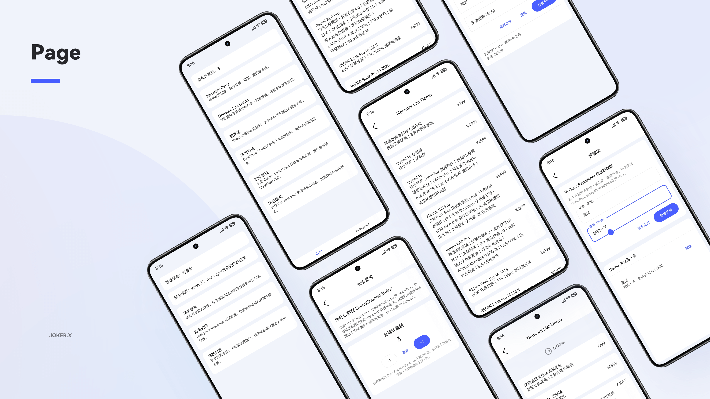

<div align="center">


# AndroidProject-Compose

_A fast-start Android framework built with Jetpack Compose_

<!-- Language Switch Button -->
<div align="center">
  <a href="README.md">🌍 中文</a>
</div>

[](https://github.com/Joker-x-dev/AndroidProject-Compose)
[](https://gitee.com/Joker-x-dev/AndroidProject-Compose)
[](https://www.pgyer.com/AndroidProject-Compose)
[](https://compose.dusksnow.top)
[](https://deepwiki.com/Joker-x-dev/AndroidProject-Compose)

</div>

## 📖 Project Overview

AndroidProject-Compose is a **single-module Jetpack Compose scaffold** that ships with the essential building blocks for networking, state, navigation, theming, data storage, and database access. It also includes a few feature demo pages so you can “clone → run → plug in your business logic” to quickly build or learn a modern Compose app.

> If this project helps you, please give it a Star ⭐ It means a lot and keeps me motivated to maintain and update the project long-term!

## 📱 Preview



### 📍 Project Links

- **GitHub**: [https://github.com/Joker-x-dev/AndroidProject-Compose](https://github.com/Joker-x-dev/AndroidProject-Compose)
- **Gitee**: [https://gitee.com/Joker-x-dev/AndroidProject-Compose](https://gitee.com/Joker-x-dev/AndroidProject-Compose)

> This scaffold originates from the CoolMall practice project and keeps only the foundational capabilities plus sample pages. For the full e-commerce business, complete UI/animations, and full-featured demos, see CoolMall: GitHub https://github.com/Joker-x-dev/CoolMallKotlin ｜ Gitee https://gitee.com/Joker-x-dev/CoolMallKotlin

### Demo Download

**Release build (2MB)**: [Download](https://www.pgyer.com/AndroidProject-Compose)
- **Supported OS**: Android 6.0 and above
- **Release notes**: Preview builds update occasionally and may not always reflect the latest code changes

### Documentation

- **Repository docs (Chinese)**: [View locally](docs/android-project-compose/README.md)
- **Online docs**: [compose.dusksnow.top](https://compose.dusksnow.top)
- **Note**: The repository and online docs cover quick start, architecture, Core capabilities, navigation, and Feature development conventions.

## 🛠️ Tech Stack

### Core Technologies

| Category              | Technology          | Description                  |
|-----------------------|---------------------|------------------------------|
| Programming Language  | Kotlin              | 100% Kotlin                  |
| UI Framework          | Jetpack Compose     | Declarative UI framework     |
| Dependency Injection  | Hilt                | Dagger-based DI framework    |

### Feature Modules

| Category   | Technology             | Description               |
|------------|------------------------|---------------------------|
| Navigation | Navigation Compose     | Compose navigation        |
| Network    | Retrofit + OkHttp      | HTTP client               |

### Data Storage

| Category      | Technology | Description                      |
|---------------|------------|----------------------------------|
| Database      | Room       | SQLite database                  |
| Local Storage | MMKV       | High-performance key-value store |

### Development Tools

| Category          | Technology | Description            |
|-------------------|------------|------------------------|
| Logging           | Timber     | Log management         |
| Network Debugging | Chucker    | Network request monitor|
| Memory Leak Check | LeakCanary | Memory leak detection  |

## 📱 Feature Module Directory

- **Main Module (main)**
  - Main page (main)
  - Core capability demos (core-demo)
  - Navigation demos (navigation-demo)

- **Auth Module (auth)**
  - Login (login)

- **User Module (user)**
  - User info (info)

- **Demo Module (demo)**
  - Generic network request demo (network-demo)
  - Generic paged list demo (network-list-demo)
  - Database demo (database)
  - Local storage demo (local-storage)
  - State management demo (state-management)
  - Network request demo (network-request)
  - Navigation with args (navigation-with-args)
  - Navigation result passing (navigation-result)

## Project Structure

```
├── core/                 # Core
│   ├── annotation/       # Shared annotations
│   ├── base/             # Base abstractions
│   ├── data/             # Data layer
│   ├── database/         # Database
│   ├── datastore/        # Data storage
│   ├── designsystem/     # Design system
│   ├── model/            # Data models
│   ├── navigation/       # Navigation runtime and routes
│   ├── network/          # Network layer
│   ├── result/           # Result handling
│   ├── state/            # State management
│   ├── ui/               # UI components
│   └── util/             # Utilities
├── feature/              # Feature modules
│   ├── main/             # Main module
│   ├── auth/             # Auth module
│   ├── user/             # User module
│   └── demo/             # Demo module
└── MainActivityViewModel.kt # Host-level shared ViewModel
```

## 👥 Join the Community

Welcome to the developer group—share learning notes and discuss technical questions together!

<div align="left">
  
  <p>Scan or search the group number to join the QQ group</p>
</div>

## 🤝 Contributing

This is an open learning project. All Android enthusiasts are welcome to contribute!

### 🎯 How to Contribute

- **Code Contributions**: Submit pull requests to improve features or fix issues
- **Issue Feedback**: Report bugs or suggest features via Issues
- **Documentation**: Enhance docs, add usage guides or developer guides
- **Design Support**: Provide UI/UX suggestions or assets
- **Testing Help**: Join feature testing and share feedback

### 📋 Contribution Guidelines

- Please follow the project coding conventions before submitting code
- For new features, create an Issue first to discuss feasibility
- Sharing learning notes and technical takeaways is encouraged
