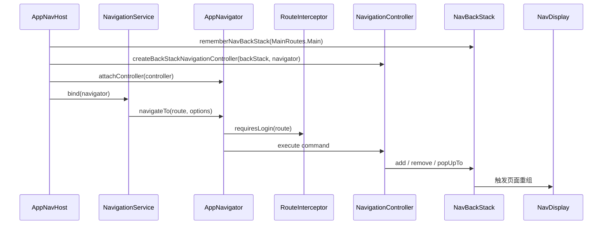

# 导航流程

## 介绍

当前导航运行时由 `AppNavHost`、`AppNavigator`、`NavigationService` 和 `NavigationController` 组成。业务侧发出 `NavKey` 命令，宿主侧将命令转换为 `NavBackStack` 变化，再由 `NavDisplay` 根据 Graph 渲染页面。控制器未绑定时，`AppNavigator` 会暂存命令，绑定后按顺序执行。

“暂存命令”仅适用于直接持有 `AppNavigator` 实例的调用方。顶层 `navigate(...)` 会先经过 `NavigationService.requireNavigator()`；服务尚未绑定时会直接抛出异常。

## 运行顺序

下图展示宿主绑定、命令分发和页面渲染的先后关系。



## 核心 API

| API | 默认值或行为 | 说明 |
| --- | --- | --- |
| `AppNavigator.navigateTo(route, navOptions)` | `navOptions = null` | 执行登录拦截后发送 `NavigateTo` 命令。 |
| `AppNavigator.navigateBack()` | 栈底不移除 | 发送 `NavigateUp` 命令。 |
| `AppNavigator.navigateBackTo(route, inclusive)` | `inclusive = false` | 回退到栈内最后一个相同路由。 |
| `navigateAndCloseCurrent(route, currentRoute)` | `inclusive = true` | 清理当前路由后追加目标路由。 |
| `navigateWithPopUpTo(route, popUpToRoute, inclusive)` | `inclusive = false` | 清理到指定路由后追加目标路由。 |
| `NavigationOptions.allowPopToEmpty` | `false` | 目标是栈底且 `inclusive = true` 时，是否允许清空原栈再追加新路由。 |

## 宿主初始化

`AppNavHost` 的默认入口是 `MainRoutes.Main`。它创建控制器并在组合生命周期内绑定导航服务；`onDispose` 中会按相反顺序解绑。

文件位置：`core/navigation/AppNavHost.kt`。以下是函数体内的真实绑定片段，省略同函数中的 `SharedTransitionLayout` 与 `NavDisplay` 配置，不能作为独立函数复制。

```kotlin
// 首项固定为主页面，后续页面通过 AppNavigator 修改同一个回退栈。
val backStack = rememberNavBackStack(MainRoutes.Main)
// 负责把导航命令转换为回退栈变化的控制器。
val navigationController = remember(backStack, navigator) {
    createBackStackNavigationController(backStack, navigator)
}

DisposableEffect(navigationController) {
    // 绑定期间，NavigationService 的顶层函数才有可用导航器。
    navigator.attachController(navigationController)
    NavigationService.bind(navigator)
    onDispose {
        NavigationService.unbind(navigator)
        navigator.detachController(navigationController)
    }
}
```

上述代码是宿主绑定片段的简化示例，真实 `AppNavHost` 还负责配置 `NavDisplay`、状态保存装饰器、Shared Transition 和前进/返回动画。

应用入口位于 `MainActivity`。Hilt 注入唯一的 `AppNavigator`，主题完成后挂载导航宿主：

```kotlin
@AndroidEntryPoint
class MainActivity : ComponentActivity() {
    /** 应用级导航器 */
    @Inject
    lateinit var navigator: AppNavigator

    /**
     * 创建 Activity 并挂载 Compose 导航宿主。
     *
     * @param savedInstanceState Activity 恢复状态
     */
    override fun onCreate(savedInstanceState: Bundle?) {
        super.onCreate(savedInstanceState)
        setContent {
            AppTheme {
                // AppNavHost 进入组合后才会绑定 NavigationService。
                AppNavHost(navigator = navigator)
            }
        }
    }
}
```

该片段来自 `MainActivity.kt` 的导航相关部分，省略启动屏和 edge-to-edge 配置；所需类型由 AndroidX Activity、Hilt、`AppTheme` 和 `AppNavHost` 提供。

## 发出导航命令

### ViewModel / 业务层

业务层优先调用模块 Navigator；一次性动作可以调用 `NavigationService` 的顶层简写函数。两者最终都进入 `AppNavigator`。

文件位置：任意业务域 ViewModel 或事件处理类。

```kotlin
import com.joker.kit.core.navigation.demo.DemoNavigator
import com.joker.kit.core.navigation.navigateBack
import com.joker.kit.core.navigation.navigateBackTo
import com.joker.kit.core.navigation.main.MainRoutes

/**
 * 常用导航命令示例。
 */
class NavigationCommandExample {
    /**
     * 打开业务页面。
     */
    fun openPage() {
        DemoNavigator.toNetworkDemo()
    }

    /**
     * 打开带参数页面。
     */
    fun openDetail() {
        // 模块 Navigator 统一构造携带商品 ID 的类型安全路由。
        DemoNavigator.toNavigationWithArgs(goodsId = 1001L)
    }

    /**
     * 返回上一页。
     */
    fun goBack() {
        navigateBack()
    }

    /**
     * 返回主页面并保留主页面本身。
     */
    fun returnToMain() {
        navigateBackTo(MainRoutes.Main)
    }
}
```

### 控制器与回退栈

当前 `BackStackNavigationController` 对命令的行为如下：

| 命令 | 回退栈行为 |
| --- | --- |
| `navigateTo(route)` | 直接 `backStack.add(route)`。 |
| `navigateTo(route, NavigationOptions)` | 先按 `popUpToRoute`、`inclusive` 和 `allowPopToEmpty` 清理，再追加目标路由。 |
| `navigateBack()` | 栈大小大于 1 时移除最后一项；不会移除唯一的栈底页面。 |
| `navigateBackTo(route, inclusive)` | 删除目标路由之后的项；`inclusive = true` 时连目标路由一起删除。若目标是栈底且 `allowPopToEmpty = false`，控制器仍保留唯一的栈底页面；`navigateBackTo` 本身没有清空栈底的选项。 |
| `popBackStackWithResult(key, result)` | 先分发结果，再执行一次 `navigateBack()`。 |

## 栈清理示例

`NavigationOptions` 由 `NavigationService` 的语义化方法创建。登录成功后关闭当前登录页，可使用 `navigateAndCloseCurrent`；需要清理到指定页面时可使用 `navigateWithPopUpTo`。

文件位置：登录 ViewModel 或页面事件处理函数。

```kotlin
import com.joker.kit.core.navigation.auth.AuthRoutes
import com.joker.kit.core.navigation.demo.DemoRoutes
import com.joker.kit.core.navigation.main.MainRoutes
import com.joker.kit.core.navigation.navigateAndCloseCurrent
import com.joker.kit.core.navigation.navigateWithPopUpTo
import com.joker.kit.core.navigation.user.UserRoutes

/**
 * 回退栈清理示例。
 */
class StackOperations {
    /**
     * 登录成功后关闭登录页。
     */
    fun finishLogin() {
        // 登录状态必须先更新为 true；inclusive = true 会移除 AuthRoutes.Login。
        navigateAndCloseCurrent(
            route = UserRoutes.Info,
            currentRoute = AuthRoutes.Login,
        )
    }

    /**
     * 清理主页面之上的页面并打开网络示例页。
     */
    fun openNetworkDemoFromMain() {
        // inclusive = false 保留 MainRoutes.Main，再追加新的网络示例路由。
        navigateWithPopUpTo(
            route = DemoRoutes.NetworkDemo,
            popUpToRoute = MainRoutes.Main,
            inclusive = false,
        )
    }
}
```

::: warning 重复栈项
`navigateWithPopUpTo` 总会在清理完成后追加 `route`。如果 `route` 与保留的 `popUpToRoute` 相同，会产生两个相邻的相同路由；只回到已有页面时使用 `navigateBackTo(...)`。
:::

## 常见问题

### 调用简写函数抛出 `AppNavigator is not bound`

`NavigationService.requireNavigator()` 在 `AppNavHost` 尚未执行绑定时会抛出该异常。将导航调用放在宿主进入组合之后，或通过已经进入页面的事件触发。

### 目标页面没有显示

依次检查目标 `NavKey` 是否实现 `NavKey`、对应 `entry<Route>` 是否存在，以及该 Feature Graph 是否已加入 `appEntryProvider`。

### 返回键没有清空栈底

这是当前控制器的保护行为：`navigateBack()` 只在栈大小大于 1 时移除末项。需要替换栈底时可在 `navigate(...)` 中显式传入 `NavigationOptions(allowPopToEmpty = true)`；控制器会清空原栈后追加目标路由。

### `navigateBackTo` 没有产生变化

控制器只会回退到栈内最后一个与目标相等的路由。目标不存在时，`popUpTo` 会直接返回，当前回退栈保持不变。

## 验证回退栈

以 `Main → NavigationWithArgs → NetworkDemo` 为例逐步验证：

1. 调用 `navigateBack()`，栈应恢复为 `Main → NavigationWithArgs`。
2. 再打开 `NetworkDemo`，调用 `navigateBackTo(MainRoutes.Main)`，栈应只保留 `Main`。
3. 从 `Main` 调用 `navigateWithPopUpTo(NetworkDemo, Main, false)`，栈应为 `Main → NetworkDemo`。
4. 在栈底调用 `navigateBack()`，`Main` 不应被移除。

如果页面展示与预期不一致，先记录每次操作前后的 Route 顺序，再检查使用的是“回退到已有页面”还是“清理后追加新页面”。

## 相关链接

- [路由配置](./router.md)：新增路由、Graph 和模块跳转封装。
- [Android Navigation 3 官方指南](https://developer.android.com/guide/navigation/navigation-3)：了解状态驱动回退栈和 `NavDisplay`。
