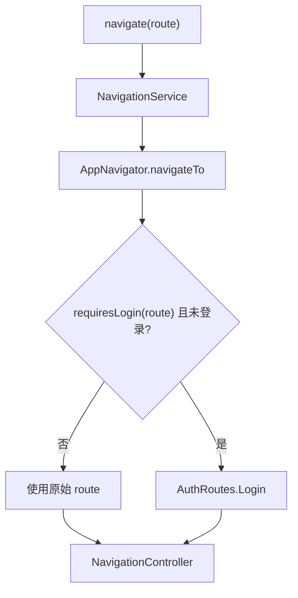

# 登录与路由拦截

## 介绍

`RouteInterceptor` 在 `AppNavigator.navigateTo(...)` 的统一入口检查目标路由是否需要登录。未登录用户访问受保护路由时，目标会被替换为 `AuthRoutes.Login`；业务 ViewModel 和模块 Navigator 不需要重复编写登录判断。

拦截器只决定“当前导航操作实际压入哪个 Route”，不验证页面参数，也不负责登录请求。登录状态来自[全局状态](../框架核心/state.md)，目标页面数据仍由自己的 ViewModel 加载。

当前配置文件：`core/navigation/RouteInterceptor.kt`。

## 当前受保护路由

源码中的受保护类型集合只有 `UserRoutes.Info`：

```kotlin
import androidx.navigation3.runtime.NavKey
import com.joker.kit.core.navigation.user.UserRoutes
import kotlin.reflect.KClass

/**
 * 需要登录的路由类型集合。
 */
private val loginRequiredRouteTypes: Set<KClass<out NavKey>> = setOf(
    UserRoutes.Info::class,
)
```

集合比较的是路由的 Kotlin 类型，而不是路由实例的字符串值；因此带参数路由也可以按类型加入集合。

## 核心 API

| API | 输入 | 返回 | 说明 |
| --- | --- | --- | --- |
| `requiresLogin(route)` | `NavKey` | `Boolean` | 判断 `route::class` 是否位于受保护类型集合。 |
| `getLoginRoute()` | 无 | `NavKey` | 当前固定返回 `AuthRoutes.Login`。 |
| `AppNavigator.navigateTo(route, navOptions)` | `NavKey`、可选 `NavigationOptions` | 无 | 内部调用路由解析后，再向控制器发送命令。 |

## 拦截流程

下图展示受保护路由从请求到实际目标解析的过程。



`AppNavigator` 使用注入的 `UserState.isLoggedIn` 当前值判断登录状态：

```kotlin
/**
 * 解析实际跳转路由。
 *
 * @param route 调用方请求的原始路由
 * @return 经过登录策略处理后的路由
 */
private fun resolveTargetRoute(route: NavKey): NavKey {
    return if (routeInterceptor.requiresLogin(route) && !userState.isLoggedIn.value) {
        // 未登录时只替换为登录页，不记录原始目标或自动恢复目标。
        routeInterceptor.getLoginRoute()
    } else {
        route
    }
}
```

拦截只发生在 `AppNavigator` 的 `navigateTo`；直接操作 `NavBackStack` 或绕过 `AppNavigator` 的代码不属于当前支持的业务调用方式。

## 新增受保护页面

1. 在 `RouteInterceptor.loginRequiredRouteTypes` 中加入目标路由的 `KClass`。
2. 确认 `UserState.isLoggedIn` 在登录成功后被更新。
3. 从未登录状态调用模块 Navigator，验证实际栈顶为 `AuthRoutes.Login`。
4. 登录页变更时同步修改 `getLoginRoute()` 返回值，并验证该路由已经在 `authGraph()` 注册。

验证方式：登录状态为 `false` 时调用 `UserNavigator.toUserInfo()`，应进入 `AuthRoutes.Login`；登录状态为 `true` 时调用相同方法，应进入 `UserRoutes.Info`。

## 登录成功后的行为

当前 Demo 登录页按以下顺序执行：

```text
LoginViewModel.login()
→ 构造示例 Auth 与 User
→ UserState.updateUserState(auth, user)
→ MMKV 与内存 StateFlow 同步为已登录
→ navigateBack()
```

因此，用户从某页尝试进入 `UserRoutes.Info` 被拦截后，登录成功只会返回发起跳转的上一页，不会自动进入用户信息页。需要“登录后继续原目标”时，必须把目标 Route 设计为显式、可恢复的数据，并定义登录成功后的消费与清理规则。

::: warning 示例认证数据
当前 `LoginViewModel` 使用 `demo-token` 和演示用户，只用于验证拦截流程。接入真实业务时应由 `AuthRepository` 发起登录请求，再把服务端返回的 `Auth` 与 `User` 写入 `UserState`。
:::

## 注意事项

- 当前实现只判断“是否登录”，没有会员、角色或权限等级策略；复杂策略需要扩展 `RouteInterceptor`，并保持从 `AppNavigator` 统一调用。
- 未登录跳转到登录页时，源码不会保存原始目标路由；如需登录后回到原页面，必须另行设计显式状态或结果流，不能假定已有恢复行为。
- 拦截只替换目标 `route`，原调用传入的 `NavigationOptions` 仍会执行；受保护跳转同时清理回退栈时，需要验证重定向到登录页后的栈结果。
- `getLoginRoute()` 返回的 `AuthRoutes.Login` 必须在 `authGraph()` 中注册，否则拦截后无法渲染目标页面。
- 受保护路由集合按 `route::class` 比较；不要把路由实例值误写成字符串。

## 相关链接

- [导航概览](./index.md)：查看 `AppNavigator` 与 Graph 的职责边界。
- [Android Navigation 3 官方指南](https://developer.android.com/guide/navigation/navigation-3)：了解类型安全路由和宿主配置。
