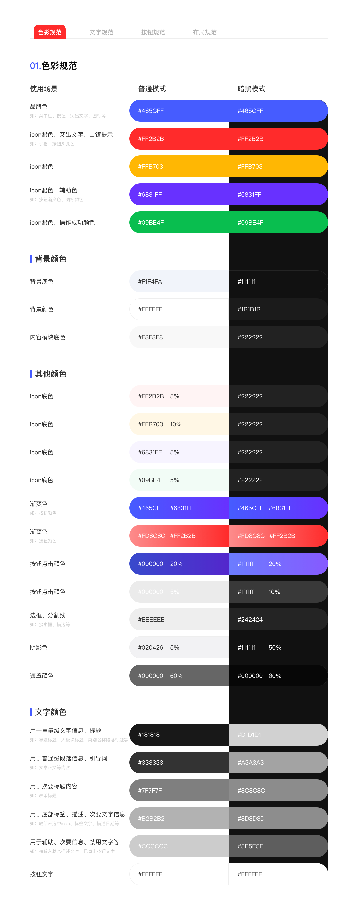
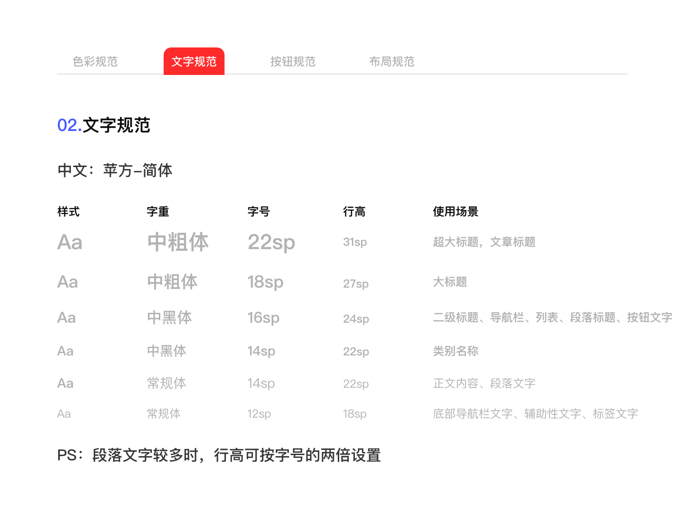
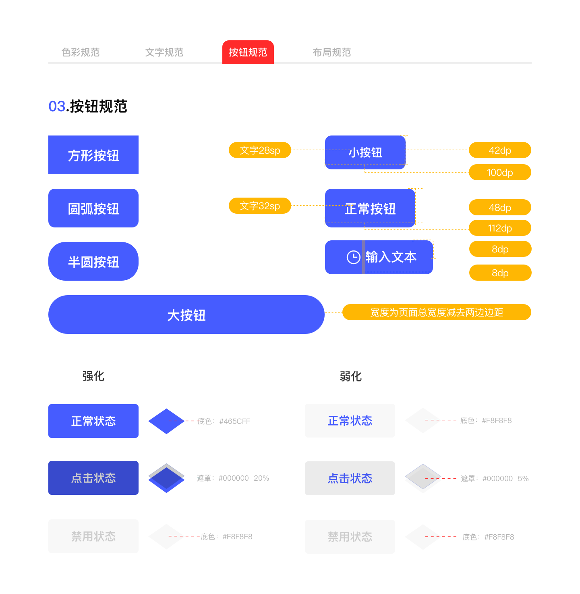
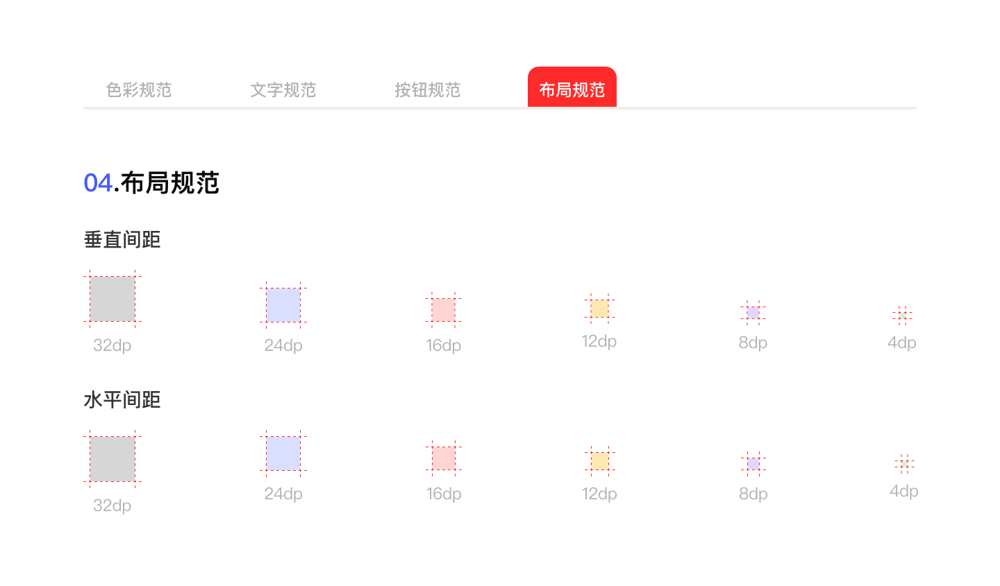

# 主题系统

## 介绍

主题系统把设计稿中的颜色、文字、按钮和布局规则落到 Compose 的 `MaterialTheme`。页面不应该直接决定一套颜色和字号；它只读取 `MaterialTheme.colorScheme`、`MaterialTheme.typography`、`MaterialTheme.shapes` 和 `Size.kt` 中的尺寸。

当前实现位于 `core/designsystem/theme/`，入口是 `Theme.kt` 的 `AppTheme`。主题支持浅色、深色以及 Android 12（API 31）以上的系统动态颜色，但动态颜色默认关闭。

## 规范图与落地位置

下面四张图是项目当前视觉规范的来源。图片保留在 `docs/public/`，正文同时说明它们如何对应源码，避免只看图却不知道应该改哪个文件。

### 色彩规范



规范图先按使用场景区分颜色，再分别给出普通模式和暗黑模式的值：

| 规范类别 | 代码入口 | 当前示例 |
| --- | --- | --- |
| 品牌主色 | `PrimaryLight`、`PrimaryDark`、`Primary` | 导航栏、主要按钮、突出文字 |
| 状态色 | `ColorDanger`、`ColorWarning`、`ColorSuccess` 及 Dark 版本 | 错误、警告、成功反馈 |
| 页面背景 | `BgGreyLight`、`BgWhiteLight`、`BgContentLight` 及 Dark 版本 | 页面、卡片、内容模块 |
| 反馈与层级 | `Mask*`、`Press*`、`Border*`、`Shadow*` | 遮罩、点击反馈、边框和阴影 |
| 文本颜色 | `TextPrimary*`、`TextSecondary*`、`TextSubtitle*`、`TextTertiary*`、`TextQuaternary*` | 标题、正文、辅助、禁用文字 |

`Theme.kt` 会把这些值写入 `lightColorScheme` 和 `darkColorScheme`。页面通常读取 `MaterialTheme.colorScheme.primary`，而不是直接读取 `PrimaryLight`，这样切换主题时组件可以自动获得对应值。

### 文字规范



`Type.kt` 使用 Compose `Typography` 把设计稿的层级映射到 Material 3 的语义名称：

| Material 3 样式 | 当前字号/行高 | 适用场景 |
| --- | --- | --- |
| `displayLarge` | 22sp / 31sp | 超大标题、文章标题 |
| `displayMedium` | 18sp / 27sp | 大标题 |
| `displaySmall` | 16sp / 24sp | 展示级文案 |
| `headlineLarge` | 16sp / 24sp | 二级标题、导航栏、列表和按钮 |
| `headlineMedium` | 14sp / 22sp | 类别名称 |
| `headlineSmall` | 13sp / 20sp | 信息分组小标题 |
| `titleLarge` | 16sp / 20sp | 模块标题、弹窗标题 |
| `titleMedium` | 14sp / 20sp | 列表项标题、辅助标题 |
| `titleSmall` | 12sp / 18sp | 段落内小标题 |
| `bodyLarge` | 14sp / 22sp | 正文内容 |
| `bodyMedium` | 12sp / 18sp | 底部导航、辅助文字、标签 |
| `bodySmall` | 11sp / 16sp | 次级正文 |
| `labelLarge` | 12sp / 16sp | 按钮和操作文字 |
| `labelMedium` | 11sp / 16sp | 辅助标签 |
| `labelSmall` | 10sp / 14sp | 最小标签、角标 |

页面优先使用 `MaterialTheme.typography` 的语义名称，不要因为“看起来差不多”把 `bodyMedium` 和 `labelLarge` 互换。长段落仍要保持足够行高，避免把设计稿中的字号直接当作行高。

### 按钮规范



按钮规范图描述了形状、尺寸、文字和状态反馈，但当前源码还没有统一的 `AppButton` 公共组件。实际使用时应这样理解：

- 颜色读取 `MaterialTheme.colorScheme.primary`、`onPrimary`、`surface` 等语义颜色。
- 文字读取 `MaterialTheme.typography.labelLarge` 或其他与场景匹配的样式。
- 圆角读取 `ShapeSmall`、`ShapeMedium`、`ShapeLarge` 等，不直接写 `RoundedCornerShape(12.dp)`。
- 内边距和高度由页面组件或 Material 3 Button API 管理；如果多个页面重复同一按钮组合，再在 `core/ui` 中封装，而不是把业务按钮塞入 `designsystem/theme`。
- 按压、禁用和危险操作要使用规范中的状态色，不能只复用正常态颜色。

### 布局规范



`Size.kt` 目前定义了同一组水平和垂直间距：4dp、8dp、12dp、16dp、24dp、32dp；同时定义 4/8/12/16dp 内边距和 0.5dp 分割线、2dp 指示器。

| 语义 | 代码 | 值 |
| --- | --- | ---: |
| 垂直间距 | `SpaceVerticalXSmall` … `SpaceVerticalXXLarge` | 4dp … 32dp |
| 水平间距 | `SpaceHorizontalXSmall` … `SpaceHorizontalXXLarge` | 4dp … 32dp |
| 页面内边距 | `SpacePaddingXSmall`、`Small`、`Medium`、`Large` | 4/8/12/16dp |
| 分割线/指示器 | `SpaceDivider`、`SpaceIndicator` | 0.5/2dp |

布局组件可以直接使用同名 `SpaceVerticalSmall()` 和 `SpaceHorizontalMedium()`；需要传给 Modifier 或 Arrangement 时，使用 `Size.kt` 中的 `Dp` 常量。

## `AppTheme` 的运行方式

文件位置：`core/designsystem/theme/Theme.kt`。`AppTheme` 只负责选择配色，并把颜色、字体和形状交给 Material 3；它不处理导航、页面状态或业务数据。下面省略同文件中 `LightColorScheme` 与 `DarkColorScheme` 的字段定义，只保留主题选择逻辑。

```kotlin
import android.os.Build
import androidx.compose.foundation.isSystemInDarkTheme
import androidx.compose.material3.MaterialTheme
import androidx.compose.material3.dynamicDarkColorScheme
import androidx.compose.material3.dynamicLightColorScheme
import androidx.compose.runtime.Composable
import androidx.compose.ui.platform.LocalContext

/**
 * 应用主题
 *
 * @param darkTheme 是否使用深色主题
 * @param dynamicColor 是否使用 Android 12 及以上动态颜色
 * @param content 应用主题的 Compose 内容
 */
@Composable
fun AppTheme(
    darkTheme: Boolean = isSystemInDarkTheme(),
    dynamicColor: Boolean = false,
    content: @Composable () -> Unit,
) {
    // 根据动态颜色开关和明暗模式选择页面配色
    val colorScheme = when {
        dynamicColor && Build.VERSION.SDK_INT >= Build.VERSION_CODES.S -> {
            // 动态颜色 API 使用的 Android 上下文
            val context = LocalContext.current
            // 动态颜色仍然跟随当前明暗模式。
            if (darkTheme) dynamicDarkColorScheme(context) else dynamicLightColorScheme(context)
        }
        darkTheme -> DarkColorScheme
        else -> LightColorScheme
    }

    MaterialTheme(
        colorScheme = colorScheme,
        typography = Typography,
        shapes = AppShapes,
        content = content,
    )
}
```

应用入口直接使用 `AppTheme { ... }` 时，`darkTheme` 默认调用 `isSystemInDarkTheme()`，因此跟随系统明暗模式；`dynamicColor` 默认关闭。包裹在 `content` 中的任意 Composable 都能读取同一套 `MaterialTheme`，具体页面结构不属于本页范围。

## 浅色、深色和动态颜色

| 配置 | 行为 | 适用场景 |
| --- | --- | --- |
| `darkTheme = false` | 使用 `LightColorScheme` | 固定浅色预览或特定页面 |
| `darkTheme = true` | 使用 `DarkColorScheme` | 深色 Preview 或手动主题切换 |
| `darkTheme = isSystemInDarkTheme()` | 跟随系统明暗设置 | 应用默认入口 |
| `dynamicColor = true` 且 API 31+ | 使用系统动态颜色 | 明确接受系统调色板的应用 |
| `dynamicColor = true` 且 API < 31 | 回退到项目自定义配色 | 兼容旧设备 |

动态颜色默认是 `false`，因为项目规范图使用固定品牌色。打开后应重新检查按钮、文本和错误提示的对比度，不要只验证浅色设备。

## 修改主题的步骤

1. 先确认规范图和修改原因，判断是新增语义还是调整现有值。
2. 修改 `Color.kt`、`Type.kt`、`Shape.kt` 或 `Size.kt` 中对应的令牌。
3. 如果令牌需要成为 Material 3 的标准语义，在 `Theme.kt` 的浅色和深色方案中同时接入。
4. 在 `core/ui` 和至少一个 Feature 页面验证正常态、点击态、禁用态、浅色和深色。
5. 更新本页的规范图说明和示例，确保文档不会落后于代码。

::: warning 不要把设计稿数字直接复制到页面
规范图是设计依据，代码中的最终入口是 `Color.kt`、`Type.kt`、`Shape.kt` 和 `Size.kt`。如果页面直接写颜色、字号或圆角，后续换肤和全局调整会绕过主题系统。
:::

## 相关链接

- [设计系统](./designsystem.md)：学习布局封装和主题令牌如何被页面使用。
- [UI 组件](./ui.md)：查看 AppBar、Scaffold、网络容器和状态组件。
- [Material 3 主题](https://developer.android.com/develop/ui/compose/designsystems/material3)
- [Material 3 深色主题](https://developer.android.com/develop/ui/compose/designsystems/dark-theme)
- [Material 3 设计系统](https://m3.material.io/)
