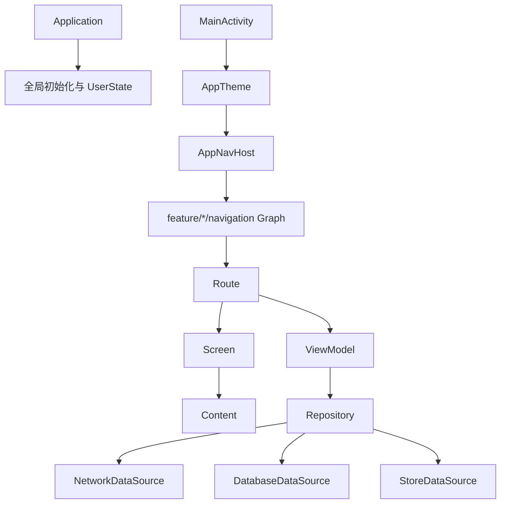

# 项目架构与职责

## 介绍

AndroidProject-Compose 在单个 `:app` 模块内组织应用入口、Feature UI、ViewModel、Repository 和数据源。架构重点是保持页面职责可测试、数据入口统一，并由 Navigation 3 集中管理页面栈。包目录表达逻辑边界，但不会形成独立 Gradle 模块的编译隔离。

初次接触项目时，只需要先记住三条关系：`MainActivity` 负责挂载 Compose，`AppNavHost` 负责把路由映射到页面，Feature ViewModel 通过 Repository 获取数据。后面的章节会分别展开这三条关系，不要求一次记住全部目录。

本文只解释系统由哪些层组成、各层依赖谁以及数据如何流动。页面创建步骤、具体 Composable 写法和代码模板分别放在 [View 规范](../业务功能/view.md)、[ViewModel 规范](../业务功能/viewmodel.md)与[创建页面流程](../业务功能/create-page.md)中。

## 架构目标

- **UI 单向传递**：Route 获取 ViewModel 和状态，Screen 处理外层框架与页面状态，Content 绘制最终业务布局。
- **数据入口统一**：ViewModel 调用 Repository，Repository 再访问网络、数据库或本地存储数据源。
- **导航集中组装**：应用宿主统一维护回退栈、动画、页面状态和模块 Graph。
- **全局能力集中初始化**：Hilt、日志、存储、Toast、刷新配置和用户状态由 `Application` 管理。

## 整体链路

下图展示从应用初始化到页面渲染、再到数据源访问的主要调用关系。



## 应用启动

| 顺序 | 文件 | 职责 |
| --- | --- | --- |
| 1 | `Application.kt` | 初始化 Toast、Timber、MMKV、刷新组件和 `UserState`。 |
| 2 | `MainActivity.kt` | 安装启动页、启用 edge-to-edge，并创建 Compose 内容。 |
| 3 | `core/navigation/AppNavHost.kt` | 创建以 `MainRoutes.Main` 开始的回退栈，绑定导航控制器。 |
| 4 | `AppNavHost.kt` 的 `appEntryProvider` | 聚合 `mainGraph`、`demoGraph`、`authGraph` 与 `userGraph`。 |
| 5 | `feature/main/navigation/MainGraph.kt` | 将 `MainRoutes.Main` 映射到 `MainRoute()`。 |

`AppNavHost` 在组合生命周期内绑定 `AppNavigator` 与 `NavigationService`，销毁时解除绑定，避免导航命令继续发送到失效宿主。它还为 Navigation 3 配置页面状态保存、ViewModel Store、前进与返回动画。

## 页面分层

Feature 页面的固定主链是 Route → Screen → Content。页面简单时，三层可以保留在同一个 Kotlin 文件中，但职责不合并：

| 层级 | 输入 | 输出与职责 |
| --- | --- | --- |
| Route | Hilt ViewModel、路由参数 | 收集状态，把 ViewModel 方法转换为 UI 回调。 |
| Screen | 可渲染状态、事件回调 | 按页面需要组织 `Scaffold`、页面骨架以及 Loading、Empty、Error、Success 状态分支。 |
| Content | 成功数据或普通页面数据、局部交互回调 | 绘制页面真正显示的业务内容，不处理缺省状态。 |
| ViewModel | Repository、应用级状态 | 执行业务操作并更新 `StateFlow` 等可观察状态。 |

Content 函数统一使用 `<PageName>Content` 命名。`MainScreen` 需要承载多个顶级页和底部导航，因此使用无 `Scaffold` 的外层布局，并通过 `MainContent` 显示最终内容。具体职责和示例由 [View 规范](../业务功能/view.md)说明。

## 数据访问

当前数据访问按照以下方向组织：

```text
Feature ViewModel
    ↓
core/data/repository
    ↓
core/network/datasource → core/network/service → Retrofit
core/database/datasource → DAO → Room
core/datastore/datasource → MMKV
```

- ViewModel 决定何时发起业务操作，并维护页面可观察状态。
- Repository 负责聚合数据源、选择线程或返回 `Flow`。
- DataSource 隔离具体网络、数据库和存储实现。
- Service、DAO 与 MMKV 实现不应直接暴露给 Feature 页面。

本节只定义运行时的数据依赖方向。Repository API、线程切换和错误处理分别在网络、数据层、Room 与本地存储章节说明；Compose 设计期预览数据不经过这条链路，单独由[数据层](../框架核心/data.md#预览数据)说明。

## 导航职责

| 位置 | 职责 |
| --- | --- |
| `core/navigation/*Routes.kt` | 定义实现 `NavKey` 的可序列化路由。 |
| `core/navigation/*Navigator.kt` | 封装业务域跳转语义。 |
| `feature/*/navigation/*Graph.kt` | 把路由映射到对应 Route。 |
| `core/navigation/AppNavigator.kt` | 分发导航命令、执行登录拦截和传递结果。 |
| `core/navigation/AppNavHost.kt` | 管理回退栈、动画、状态保存与 Graph 聚合。 |

详细调用方式参见[导航流程](../导航/flow.md)与[路由配置](../导航/router.md)。

## 依赖约束

- Content 层不获取 ViewModel，不直接调用 Repository、Service、DAO 或存储实现。
- Screen 通过参数接收状态和回调，保证 Preview 不依赖 Hilt 或导航宿主。
- Route 负责连接 ViewModel 与 Screen，不承载具体布局。
- ViewModel 不直接持有 Activity、Composable 或具体 View 引用。
- Repository 是 Feature 访问网络、数据库和持久化数据源的统一入口；应用级状态由对应状态对象管理，设计期 Preview Provider 不参与运行时数据访问。
- 应用级组装与可复用导航运行时目前位于同一目录；拆分 Gradle 模块前需先分离这两类职责。

## 相关链接

- [工程组织与模块边界](./modularization.md)
- [View 规范](../业务功能/view.md)
- [ViewModel 规范](../业务功能/viewmodel.md)
- [创建页面流程](../业务功能/create-page.md)：查看 Route、Graph、ViewModel 与 Screen 的实际接入步骤。
- [Android 官方应用架构指南](https://developer.android.com/topic/architecture)
- [Compose 状态与单向数据流](https://developer.android.com/develop/ui/compose/state)
- [Navigation 3 官方指南](https://developer.android.com/guide/navigation/navigation-3)
- [Hilt 依赖注入指南](https://developer.android.com/training/dependency-injection/hilt-android)
