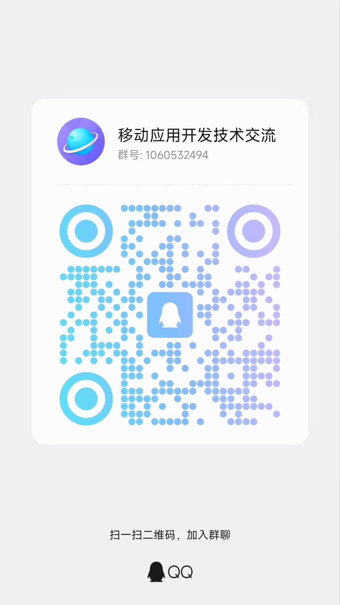

# 社区与反馈

## 介绍

AndroidProject-Compose 提供 QQ、微信和代码托管平台三类交流入口。使用问题可在交流群讨论；能够稳定复现的缺陷和明确的功能建议，建议提交 Issue，便于记录环境、版本和处理进度。

## 交流渠道

| 场景 | 推荐渠道 | 提交内容 |
| --- | --- | --- |
| 使用方式、实现思路或学习交流 | QQ 群、微信群 | 问题背景、相关页面或源码位置。 |
| 可复现的缺陷 | GitHub Issue 或 Gitee Issue | 环境版本、复现步骤、期望结果、实际结果和日志。 |
| 功能建议 | GitHub Issue 或 Gitee Issue | 使用场景、目标行为和兼容性要求。 |
| 代码或文档贡献 | Pull Request | 变更摘要、验证结果和涉及范围。 |

## QQ 群

- 群名称：移动应用开发技术交流
- 群号：`1060532494`

扫描下方二维码，或在 QQ 中搜索群号加入。

## 微信群

微信群二维码具有有效期，不在文档中长期公开。需要加入微信群时，请先加入 QQ 群，并从群公告获取当前有效的微信群入口。

## 提交问题

提交 Issue 前，请先确认问题可以在当前分支复现，并附上以下信息：

1. Android Studio、JDK、AGP、Kotlin 和 Android SDK 版本。
2. 复现步骤、期望结果与实际结果。
3. 相关日志、截图和最小复现代码。
4. 是否修改过依赖版本、构建配置或框架源码。

请删除日志中的访问令牌、账号、手机号、服务器地址等敏感信息，再上传附件或粘贴日志。

## 项目入口

- [在 GitHub 提交 Issue](https://github.com/Joker-x-dev/AndroidProject-Compose/issues)
- [在 Gitee 提交 Issue](https://gitee.com/Joker-x-dev/AndroidProject-Compose/issues)
- [AndroidProject-Compose GitHub 仓库](https://github.com/Joker-x-dev/AndroidProject-Compose)
- [AndroidProject-Compose Gitee 仓库](https://gitee.com/Joker-x-dev/AndroidProject-Compose)
