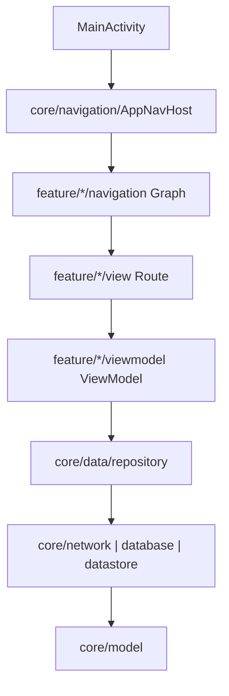

# 工程组织与模块边界

## 介绍

AndroidProject-Compose 当前采用单 Gradle 模块与包级分层结合的工程结构。`settings.gradle.kts` 只注册 `:app`，源码再按 `core/` 与 `feature/` 划分职责。这种结构减少了初始构建配置，但包之间没有 Gradle 依赖边界，代码约束需要通过目录规范和审查维护。

本文中的“模块”默认指业务域或职责目录；只有 `:app` 是可独立构建的 Gradle 模块。

## 当前工程形态

| 维度 | 当前实现 | 影响 |
| --- | --- | --- |
| Gradle 模块 | 仅 `:app` | 所有源码一起编译，依赖配置集中在 `app/build.gradle.kts`。 |
| 顶层源码目录 | `core/`、`feature/` | 用包名表达基础能力与业务功能的边界。 |
| Feature | `auth`、`demo`、`main`、`user` | 每个业务域维护自己的页面、ViewModel 和 Graph。 |
| 依赖约束 | 目录约定与代码审查 | Kotlin 编译器不会阻止跨包直接调用。 |

## 目录结构

以下结构只展示稳定的逻辑目录，不绑定源码包名或本地文件系统路径。实际包名以 Kotlin 源码的 `package` 声明和 Android Studio 当前目录为准。

```text
.
├── Application.kt                 # 应用级能力初始化
├── MainActivity.kt                # Compose 与导航宿主入口
├── MainActivityViewModel.kt       # 预留空 ViewModel 类，当前未被 MainActivity 引用
├── core/
│   ├── annotation/                # 项目级通用注解，当前为 Compose 预览注解
│   ├── base/                      # ViewModel 与 UI 状态基类
│   ├── data/                      # 数据层
│   ├── database/                  # Room、DAO 与数据库数据源
│   ├── datastore/                 # 本地存储数据源，当前使用 MMKV
│   ├── designsystem/              # 主题、尺寸和基础组件
│   ├── extension/                 # 可选扩展：跨 Feature 复用的 Kotlin 扩展函数
│   ├── model/                     # 实体、请求与网络模型
│   ├── navigation/                # 导航运行时与路由定义
│   ├── network/                   # Service、网络数据源和拦截器
│   ├── result/                    # 结果封装与转换
│   ├── state/                     # 应用级共享状态
│   ├── ui/                        # 通用 Compose 组件
│   └── util/                      # Toast、权限、时间与存储工具
└── feature/
    ├── auth/                      # 登录示例
    ├── demo/                      # 基础能力示例
    ├── main/                      # 主框架与底部导航
    └── user/                      # 用户信息示例
```

## 目录职责

### 应用入口

- `Application.kt` 初始化 Toast、Timber、MMKV、下拉刷新配置和 `UserState`。
- `MainActivity.kt` 安装启动页、启用 edge-to-edge，并在 `AppTheme` 中挂载 `AppNavHost`。
- 应用入口负责组装，不放置具体页面内容或数据请求。

### core

- `base`、`result`、`ui`、`designsystem` 和 `util` 提供跨页面复用的基础能力。
- `annotation` 存放项目级通用注解；当前只有组件、页面、主题和多设备 Compose Preview 配置。
- `data/repository`、`network`、`database` 与 `datastore` 组成当前项目的运行时数据访问链路；`data/preview` 只保存跨页面复用的设计期预览数据。
- `model` 和 `state` 同时包含示例业务使用的数据与全局状态，因此当前 `core` 不是完全独立于业务的通用库。
- `navigation` 提供 `AppNavigator`、`NavigationController`、`AppNavHost` 等运行时能力，也保存各业务域的 `NavKey` 路由定义。

跨 Feature 复用的 Preview Provider 放在 `core/data/preview`，只服务单个 Feature 的预览数据放在 `feature/<domain>/data`。跨 Feature 复用且职责稳定的 Kotlin 扩展函数放在 `core/extension`，业务私有扩展放在 `feature/<domain>/extension`。这些目录按实际职责创建，不建立空目录，也不把业务专用逻辑放入 Core。

### feature

- `view/` 维护 Route、Screen、Content 三层与 Preview。
- `viewmodel/` 维护页面状态与业务操作，通过 Repository 或应用级状态访问数据。
- `navigation/` 维护当前 Feature 的 Graph，把 `NavKey` 映射到 Route。
- Feature 之间通过导航入口协作，不直接复用其他 Feature 的页面实现。

## 依赖关系

当前主要依赖方向如下。箭头表示调用或组装关系，不表示独立 Gradle 模块依赖。



`AppNavHost` 位于 `core/navigation`，但它会导入并聚合 `feature/*/navigation` 中的 Graph，因此它在当前单模块工程中同时承担应用级组装职责。若将来拆成多 Gradle 模块，应把 Graph 聚合入口移动到应用模块，避免通用导航模块反向依赖 Feature。

## 边界规则

- 页面只通过 ViewModel 接收状态和触发业务操作，Content 层不直接访问 Repository 或数据源。
- 涉及网络、数据库或持久化数据时，ViewModel 通过 Repository 访问，不直接调用 Retrofit Service、Room DAO 或 MMKV 实现；仅使用应用级状态时可依赖对应状态对象。
- Repository 负责选择并组合网络、数据库和本地存储数据源。
- 跨页面复用的 Preview Provider 可放入 `core/data/preview`，但不参与 Repository 运行时链路。
- 跨 Feature 复用且职责稳定的 Kotlin 扩展函数可放入按需创建的 `core/extension`；业务私有扩展保留在 Feature。
- 路由对象放在 `core/navigation/<业务域>/`，Graph 放在 `feature/<业务域>/navigation/`。
- 跨 Feature 跳转使用模块 Navigator 或统一导航 API，不直接调用另一个 Feature 的 Composable。

## 何时拆分 Gradle 模块

出现以下情况时，再考虑把逻辑目录迁移为独立 Gradle 模块：

- 多个 Feature 需要独立构建、测试或按需交付。
- 团队需要通过编译依赖强制限制跨层调用。
- 基础能力需要在多个应用中独立发布和复用。
- 单模块构建时间已影响日常开发，并有数据证明拆分可以改善关键路径。

拆分前应先消除 `core/navigation/AppNavHost` 对 Feature Graph 的反向组装关系，并为公开 API 设计稳定边界。

## 相关链接

- [项目架构与职责](./architecture.md)：下一步从目录边界进入真实的启动、页面、数据和导航链路。
- [Feature 模块概览](../业务功能/index.md)：了解业务域的组成和依赖关系。
- [目录与命名规范](../业务功能/structure.md)：查看 Feature 文件与符号应该放在哪里。
- [创建页面流程](../业务功能/create-page.md)：执行新增业务域或页面的完整步骤。
- [Android 官方模块化指南](https://developer.android.com/topic/modularization)
- [Android 官方应用架构指南](https://developer.android.com/topic/architecture)
